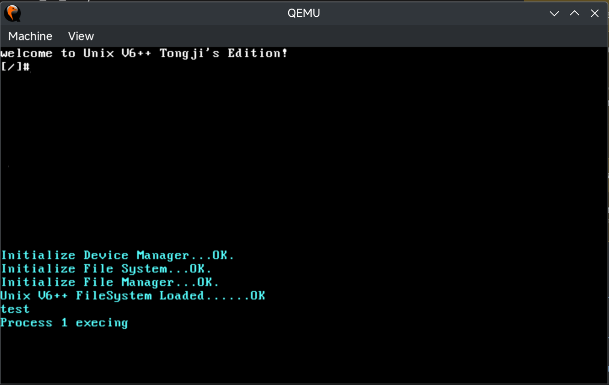
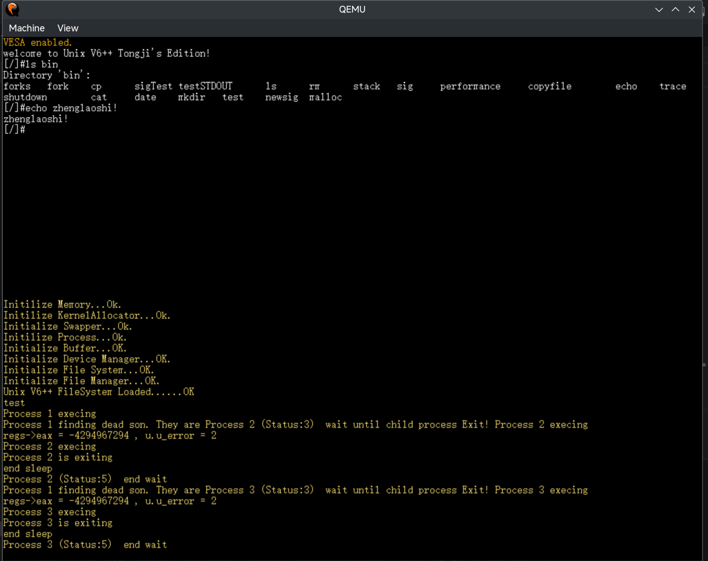

# Unix V6++ Tongji's Edition for Education

## GTY 编辑版变动

Unix V6++看上去是2008年开发完成的，至今（2024年4月30日）已有差不多15年历史。其部分设计偏老旧，难以在现代计算机上运行。同时，该系统存在诸多可优化的地方。

在完成本科毕业设计项目的同时，GTY 对 Unix V6++ 进行了一些改动，让其可以在更现代化的环境下运行，并改善了系统内的部分设计。

下面将对被更改的部分做详细说明。

### 编译系统

原来的编译系统完全基于 Makefile。现将编译系统改为 CMake 和 Makefile 混合使用。其中，Makefile 用于处理交互指令，其控制 CMake 完成编译构建等工作。

优化后，编译运行不再需要像以前那样配置环境变量，并在多个快捷方式中跳来跳去。

### VSCode 配置文件

考虑到更多人喜欢用 VSCode 做开发，现向项目中加入 VSCode 配置文件，包含 C++ 头文件搜索路径以及调试器启动参数。

见文件夹：`.vscode`

### 虚拟机变更

虚拟机从 Bochs 换成 QEMU

虚拟机运行内存从 32M 提升到 64M（内存这个改动好像没什么意义）

### 文件系统模块排布变更

原来的版本限制内核文件不能超过 99K。事实上，老版本系统的大小已经刚好卡住这个值了。一旦添加新功能，内核大小很容易突破这个上限，导致内核无法被完整加载。

通过将文件系统 INode 及以后的区域整体后移，我们将内核大小上限扩大到了 398 个盘块，即 199K，暂时看足够使用。

| 存放内容             | 变更前存放盘块 | 变更后存放盘块 |
| -------------------- | -------------- | -------------- |
| 启动引导（boot.bin） | [0, 0]         | [0, 0]         |
| 内核（kernel.bin）   | [1, 199]       | [1, 399]       |
| SuperBlock           | [200, 201]     | [400, 401]     |
| INode                | [202, 1023]    | [402, 1223]    |
| Data                 | [1024, 17999]  | [1224, 18199]  |
| Swap                 | [18000, 20159] | [18200, 20359] |

**特别注意：文件系统排布变更后，往届同学在《操作系统课程设计》作业中制作的文件系统编辑器将无法直接使用。需要将其中与盘块位置有关设置更新后才可参考。**

代码变更：

```cpp

// git diff ./src/include/FileSystem.h
-       static const int SUPER_BLOCK_SECTOR_NUMBER = 200; 
+       static const int SUPER_BLOCK_SECTOR_NUMBER = 400;   

-       static const int INODE_ZONE_START_SECTOR = 202; 
-       static const int INODE_ZONE_SIZE = 1024 - 202;  
+       static const int INODE_ZONE_START_SECTOR = 402; 
+       static const int INODE_ZONE_SIZE = 1224 - 402;  
 
-       static const int DATA_ZONE_START_SECTOR = 1024;   
-       static const int DATA_ZONE_END_SECTOR = 18000 - 1;  
-       static const int DATA_ZONE_SIZE = 18000 - DATA_ZONE_START_SECTOR; 
+       static const int DATA_ZONE_START_SECTOR = 1224;   
+       static const int DATA_ZONE_END_SECTOR = 18200 - 1; 
+       static const int DATA_ZONE_SIZE = 18200 - DATA_ZONE_START_SECTOR; 

// git diff ./src/mm/SwapperManager.cpp
-unsigned int SwapperManager::SWAPPER_ZONE_START_BLOCK = 18000;
+unsigned int SwapperManager::SWAPPER_ZONE_START_BLOCK = 18200;
```

### PSE

在启动引导过程中，启用 CPU PSE 功能，以支持 4MB 大页映射。

参考：[https://wiki.osdev.org/Paging](https://wiki.osdev.org/Paging)

### VESA

使用 VESA 控制显示屏，并在其上实现一个显示空间更大，色彩更艳丽、支持屏幕滚动的控制台。

目前这版的 VESA 驱动仅在 QEMU 平台测试成功，不保证在其他环境下的准确性。

目前，VESA 显存映射空间被放置在内核区的 128MB 位置（即 3GB + 128 MB 处），显存总大小约为 2MB。

VESA 支持可以在 src/CMakeLists.txt 内手动开关。

| 原版（CRT）                            | 新版（VESA）                           |
| -------------------------------------- | -------------------------------------- |
|  |  |

### DMA

原来的代码并没有手动开启 DMA 功能。可能是因为 Bochs 默认启用了，于是之前的代码一直没出错。

QEMU 模拟的芯片组默认关闭 DMA 功能，需要手动开启。

### libyrosstd

引入来自 [https://github.com/FlowerBlackG/YurongOS/blob/master/src/lib](https://github.com/FlowerBlackG/YurongOS/blob/master/src/lib) 的基础库代码。该库拥有更强的功能与更好的性能。

例：

1. 使用参考（抄的）自 `glibc` 的 `strlen` 函数，一次性可以判断 4 个字节。
2. 支持快速内存拷贝的 `memcpy`，在入参整齐时一次性拷贝 4 字节。这个改进可以很大程度提升 VESA Console 的滚屏体验。

## 参考运行环境

当前代码已在以下软件环境成功运行：

* `Arch Linux`
* `GNU/Linux 6.8.7-arch1-Adashima-T2 PREEMPT_DYNAMIC`
* `gcc version 13.2.1 20240417`
* `GNU gdb 14.2`
* `cmake version 3.29.2`
* `GNU Make 4.4.1`
* `QEMU version 9.0.0 (qemu-system-i386)`
* `KDE Plasma 6.0.4 (Wayland)`
