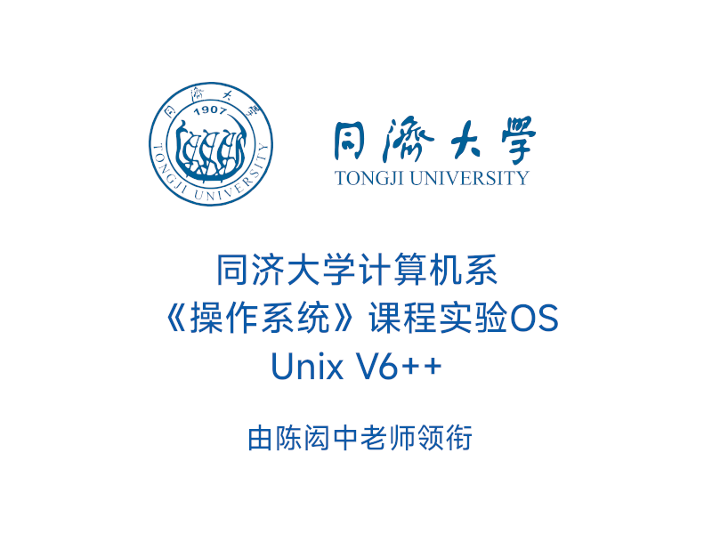

# Unix V6++ Tongji's Edition for Education

针对IA32架构开发的Unix V6系统。该系统由陈闳中教授带领多届研究生团队开发完成，是同济大学计算机系操作系统课程教学的重要部分。

## 纪录：我和学生们的“十年一剑” by Lao Chen

[https://web.archive.org/web/20190721215505/http://chenhz.tongji.asia/archives/1231](https://web.archive.org/web/20190721215505/http://chenhz.tongji.asia/archives/1231)

### 原文

32年前读硕士时，“操作系统”是学得最糟糕的一门课。学完后，每个名词都知道，但对操作系统内部如何运转，完全是一头雾水。虽然如今计算机已大大普及，但相信大多数学生在学完该课后，仍然不清楚操作系统具体是如何运转的。

20年前我自己开始讲授操作系统课，选用的教材是尤晋元教授所编《UNIX操作系统教程》。越用越觉得这是一本好教材，它不是泛泛讲原理，而是深入解剖了一个操作系统。虽然所剖析的UNIX V6如同一只小麻雀，整个内核只有8千多行代码（而windows有3千万多行，Linux也有上千万行代码），但它五脏俱全。对这只小麻雀的五脏六腑，翅膀肌肉、神经、淋巴都彻底解剖清楚后，再去理解其它鸟的原理就容易多了。相反，如果仅向学生介绍世上各种各样鸟类的翅膀、尾翼和器官，那么，学生很容易重蹈我们的覆辙：知道某种器官在鸟类中有多少种类型，但就是不知道中枢神经系统、心血管系统、内分泌系统与翅膀、尾翼之间是如何联动、如何协调的。

按说，有了这样一本讲授具体操作系统的教材，学生学起来应该容易了，但实际情况并非如此。由于UNIX V6只能运行在早就已消失的古老机器上。学生无法在该机器上做UNIX V6内核的实验，更无法通过修改UNIX V6内核来加深理解。那么，能否改用其它操作系统作为实例来深入讲解呢？Windows很普及，但因其开放程度不够；Linux倒是完全开放的，但规模也太大，不合适作为本科阶段教学对象。

大约9年前，我萌生了将UNIX V6移植到PC机上的想法。于是开始从我校的推免生中挑选基础扎实、对操作系统理解较好、并对之有浓厚兴趣的学生来做这一工作。前后有五届（共6名）非常优秀的学生参与到这项工作中来。大约花了二年半时间，完成了移植工作。为了能让学生更容易理解代码，又用面向对象的思想重新进行了设计，并用C++加以实现。因为尽可能地遵循UNIX V6的思想和算法，因此，我们将新系统命名为UNIX V6++。为方便学生自行修改UNIX V6++，又专门为它开发了一个集成环境，学生可以用它来修改、编译、调试V6++内核。如今，绝大部分工作都已完成，并已在课程中鼓励学生去试用，以听取修改意见。

前后参与这项工程的有六名极其优秀的硕士生，他们现在分别在微软总部、谷歌、摩根斯坦利、美国国家仪器、法国等公司工作。我在为这些优秀学生自豪的同时，也向他们表示深深地感谢，感谢他们以聪明才智和巨大付出帮我圆了这个梦，同时为操作系统教学作出了出色的贡献。

### 精选评论

> Wu Yuqi: 陈老师，今天听完您的最后一节课，更加坚定我想要登上讲台成为一名教师的想法。在您的课堂上，您不光是教授学科的知识，而是将自己的丰富人生经历与人交流，产生思想的火花，并且抱着一心想着是把人生的感悟传授给学生，好让学生的人生之路更加宽阔平坦的心愿，这一切都是您这门课给予我的领悟。我一直觉得苦难使人成长，看到您的经历，我觉得虽然苦难很长，但您一直用您的心去感受着这个纷杂的世界，并且用力地感恩着，热爱着生命。希望以后还能看到您的博客，谢谢老师。
>
> chenhz: 小吴，你好！临出发去欧洲之前，看到你对我夸奖分外高兴。尤其听到有学生通过这门课更坚定了做教师的决心，对一个老师来说，还有什么比这回报更令人快乐的呢？只要你内心中热爱教师这个职业，下定决心，一定能成为一名好老师。

> Yuanji Wang: 来这里给陈老师“十年一剑”的心血打气，Unix v6++的发布不仅仅完成了陈老师的梦想，同时也是我整个本科以及研究生生涯的再次的总结。很庆幸当初能够选修到陈老师的操作系统课程、在研究生阶段师从陈老师，并有勇气以此项目作为毕业论文。
> 操作系统确实是个很神奇的东西，它很值得你去再三的反复推敲与思考，每次在经过一段时间的沉淀后再次重新审视过去的理解，你总能从中找到一些新的东西，抑或是突然发现过去的理解可能有所偏差。
> 对于操作系统的理解，不应仅仅只是系统本身，他涵盖了对整个计算机系统运作的理解与认识。以操作系统作为切入点，我可以站在一个系统内部的角度从上至下，由硬件层到软件层去理解整个计算机学科，就好象你站在了钟表内部，明白每个螺丝齿轮的作用，知道他们是如何协同工作，如何达到计时和闹铃的功能的，一切都一目了然。
> 前段时间还和同事聊起关于操作系统的话题，重新有机会拾起当初点滴，感触颇多。陈老师就很“适时”的发布了UnixV6++，这大概算是一种不大不小的巧合与机缘吧。
>
> chenhz: 王元佶：谢谢你的留言。有人说，能培养出超越自己的学生的高校老师才是一名好老师。虽然你是自身优秀而非我的培养，但我可以骄傲的说自己是名好老师了，呵呵。
> 再次感谢你以自己的智慧和努力为V6++做出的出色贡献！
> 顺便向你抱怨一下，由于你在我那篇“最后的名士”留言中的忽悠，至今还有人问我，是否还会举办“计算机老师讲历史”的讲座。

### 其他记忆

> 你知道陈老师以前在同济多响的一块招牌。过道和教室后面都是站着上课的学生。那时候没有PPT，老头都是粉笔手画流程图，用大图纸手绘流程图挂着。我原来不是老陈的学生，偶尔听了一次老陈的课，叹为观止，觉得自己大学本科的操作系统白学了。那时候他正带着一群硕士生做v6++......（截取自fy的回忆，经过gty删改）

## 参考运行环境

当前代码已在以下软件环境成功运行：

 **`Arch Linux`**

* `GNU/Linux 6.8.7-arch1-Adashima-T2 PREEMPT_DYNAMIC`
* `gcc version 13.2.1 20240417`
* `GNU gdb 14.2`
* `cmake version 3.29.2`
* `GNU Make 4.4.1`
* `QEMU version 9.0.0 (qemu-system-i386)`
* `KDE Plasma 6.0.4 (Wayland)`

**`Debian 12`**

* `GNU/Linux 6.1.0-21-amd64`
* `gcc (Debian 12.2.0-14) 12.2.0`
* `GNU gdb (Debian 13.1-3) 13.1`
* `cmake version 3.25.1`
* `GNU Make 4.3`
* `QEMU version 7.2.9 (qemu-system-i386)`
* `KDE Plasma 5.27.5 (X11)`

## 物理内存占用约定

| 起始地址 | 终止地址（含） | 大小 |        用途和备注        |
| :------: | :------------: | :---: | :-----------------------: |
|    0    |      3FF      |  1KB  |   中断向量（BIOS保留）   |
|   400   |      4FF      | 256B |   BIOS数据（BIOS保留）   |
|   1000   |      1FFF      |  4KB  |       启动时的PML2       |
|    ?    |      7BFF      |   ?   |       启动时核心栈       |
|   7C00   |      7DFF      | 512B | 启动引导程序：一级启动器 |
|   7E00   |      7EFF      | 256KB |       VBE Mode Info       |
|  9FC00  |     9FFFF     |  1KB  | 扩展BIOS数据区（BIOS保留） |

## 更新记录

### 2024更新

Unix V6++看上去是2008年开发完成的，至今（2024年4月30日）已有差不多15年历史。其部分设计偏老旧，难以在现代计算机上运行。同时，该系统存在诸多可优化的地方。

在完成本科毕业设计项目的同时，GTY 对 Unix V6++ 进行了一些改动，让其可以在更现代化的环境下运行，并改善了系统内的部分设计。

下面将对被更改的部分做详细说明。

#### 编译系统

原来的编译系统完全基于 Makefile。现将编译系统改为 CMake 和 Makefile 混合使用。其中，Makefile 用于处理交互指令，其控制 CMake 完成编译构建等工作。

优化后，编译运行不再需要像以前那样配置环境变量，并在多个快捷方式中跳来跳去。

此外，编译系统会为每个子程序同时生成 ELF 和 PE 版本。其中，ELF 版本供 GDB 加载使用，PE 版本供 v6++ 内核使用。

#### VSCode 配置文件

考虑到更多人喜欢用 VSCode 做开发，现向项目中加入 VSCode 配置文件，包含 C++ 头文件搜索路径以及调试器启动参数。

见文件夹：`.vscode`

#### 虚拟机变更

虚拟机从 Bochs 换成 QEMU

虚拟机运行内存从 32M 提升到 64M（内存这个改动好像没什么意义）

#### 文件系统模块排布变更

原来的版本限制内核文件不能超过 99K。事实上，老版本系统的大小已经刚好卡住这个值了。一旦添加新功能，内核大小很容易突破这个上限，导致内核无法被完整加载。

通过将文件系统 INode 及以后的区域整体后移，我们将内核大小上限扩大到了 398 个盘块，即 199K，暂时看足够使用。

| 存放内容             | 变更前存放盘块 | 变更后存放盘块 |
| -------------------- | -------------- | -------------- |
| 启动引导（boot.bin） | [0, 0]         | [0, 0]         |
| 内核（kernel.bin）   | [1, 199]       | [1, 399]       |
| SuperBlock           | [200, 201]     | [400, 401]     |
| INode                | [202, 1023]    | [402, 1223]    |
| Data                 | [1024, 17999]  | [1224, 18199]  |
| Swap                 | [18000, 20159] | [18200, 20359] |

**特别注意：文件系统排布变更后，往届同学在《操作系统课程设计》作业中制作的文件系统编辑器将无法直接使用。需要将其中与盘块位置有关设置更新后才可参考。**

代码变更：

```cpp

// git diff ./src/include/FileSystem.h
-       static const int SUPER_BLOCK_SECTOR_NUMBER = 200; 
+       static const int SUPER_BLOCK_SECTOR_NUMBER = 400;   

-       static const int INODE_ZONE_START_SECTOR = 202; 
-       static const int INODE_ZONE_SIZE = 1024 - 202;  
+       static const int INODE_ZONE_START_SECTOR = 402; 
+       static const int INODE_ZONE_SIZE = 1224 - 402;  
 
-       static const int DATA_ZONE_START_SECTOR = 1024;   
-       static const int DATA_ZONE_END_SECTOR = 18000 - 1;  
-       static const int DATA_ZONE_SIZE = 18000 - DATA_ZONE_START_SECTOR; 
+       static const int DATA_ZONE_START_SECTOR = 1224;   
+       static const int DATA_ZONE_END_SECTOR = 18200 - 1; 
+       static const int DATA_ZONE_SIZE = 18200 - DATA_ZONE_START_SECTOR; 

// git diff ./src/mm/SwapperManager.cpp
-unsigned int SwapperManager::SWAPPER_ZONE_START_BLOCK = 18000;
+unsigned int SwapperManager::SWAPPER_ZONE_START_BLOCK = 18200;
```

#### PE Parser

原版PE Parser假定了每个段的名字和位次，但新版编译器不一定遵循该规范，导致可执行程序可能无法正确加载。新PE Parser改用字符串匹配的方式寻找需要的程序段，以解决该问题。

此外，原 PE Parser 部分代码存在错误，已对部分问题进行修复。

见：[git commit](https://github.com/FlowerBlackG/unix-v6pp-tongji/commit/9601efc2a8a99b7587aadade963fc64ae06b1d8e#diff-6fe8cd06b96adeca203104e06aaedc863e105a96bbb2dc2707b5f6777f9498b1)

#### 新增支持：ELF

考虑到 ELF 是 Unix 家族正统的可执行文件格式，且 GNU/Linux 下的 GDB 加载 PE 格式文件会出问题，特实现 ELF 格式加载器。

**注：有bug。该功能暂不可用。**

#### Splash

开机时闪烁开屏图片。



可以在 `src/CMakeLists.txt` 里禁用。

#### PSE

在启动引导过程中，启用 CPU PSE 功能，以支持 4MB 大页映射。

参考：[https://wiki.osdev.org/Paging](https://wiki.osdev.org/Paging)

#### VESA

使用 VESA 控制显示屏，并在其上实现一个显示空间更大，色彩更艳丽、支持屏幕滚动的控制台。

目前这版的 VESA 驱动仅在 QEMU 平台测试成功，不保证在其他环境下的准确性。

目前，VESA 显存映射空间被放置在内核区的 128MB 位置（即 3GB + 128 MB 处），显存总大小约为 2MB。

VESA 支持可以在 src/CMakeLists.txt 内手动开关。

| 原版（CRT）                            | 新版（VESA）                           |
| -------------------------------------- | -------------------------------------- |
|  |  |

#### DMA

原来的代码并没有手动开启 DMA 功能。可能是因为 Bochs 默认启用了，于是之前的代码一直没出错。

QEMU 模拟的芯片组默认关闭 DMA 功能，需要手动开启。

#### libyrosstd

引入来自 [https://github.com/FlowerBlackG/YurongOS/blob/master/src/lib](https://github.com/FlowerBlackG/YurongOS/blob/master/src/lib) 的基础库代码。该库拥有更强的功能与更好的性能。

例：

1. 使用参考（抄的）自 `glibc` 的 `strlen` 函数，一次性可以判断 4 个字节。
2. 支持快速内存拷贝的 `memcpy`，在入参整齐时一次性拷贝 4 字节。这个改进可以很大程度提升 VESA Console 的滚屏体验（其实可以考虑使用AVX或SSE指令进一步加速）。
